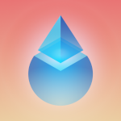
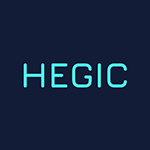

## Current projects

 **\[Unannounced Project\]** 

Passive staking solution for ??? (contracted by [Lido](https://lido.fi/)) 
website・code

 

 **\[Unannounced Project\]**

Passive staking solution for ??? (contracted by [xToken](https://xtoken.market/)) 
website・code

 

 **Lunarian**

Portfolio dashboard for the [Terra](https://terra.money/) ecosystem 
[preview](https://lunarian.herokuapp.com/)・[code](https://github.com/0xlarry/lunarian)

  

 **RuneData**

Data analytics site for [THORChain](https://thorchain.org/) liquidity providers 
[website](https://runedata.info/)・[code](https://github.com/0xlarry/runedata)

  

## Past projects

 **Hegic AutoStake**

Transaction bundler for [Hegic](https://www.hegic.co/) LPs to redeem and stake their farmed tokens 
[website](https://hegic.autostake.co/)・[contract](https://github.com/0xlarry/hegic-autostake)・[frontend](https://github.com/0xlarry/hegic-autostake-frontend)

  

 **Hegic Yield Calculator**

Tool for [Hegic](https://www.hegic.co/) LPs to estimate their yield farming returns 
[website](https://0xlarry.github.io/hegic-yield-estimator/)・[code](https://github.com/0xlarry/hegic-yield-estimator)

 

 **did-it-beat-eth.com** 

Compare performances of altcoins against ETH 
[code](https://github.com/0xlarry/did-it-beat-eth)

 
