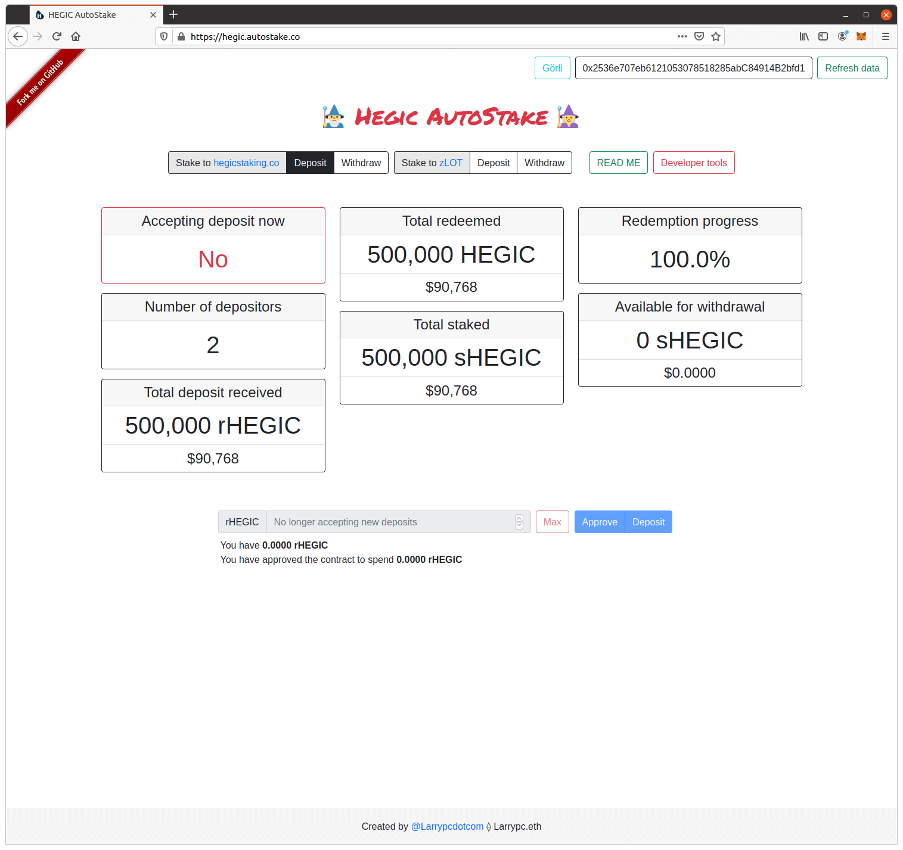
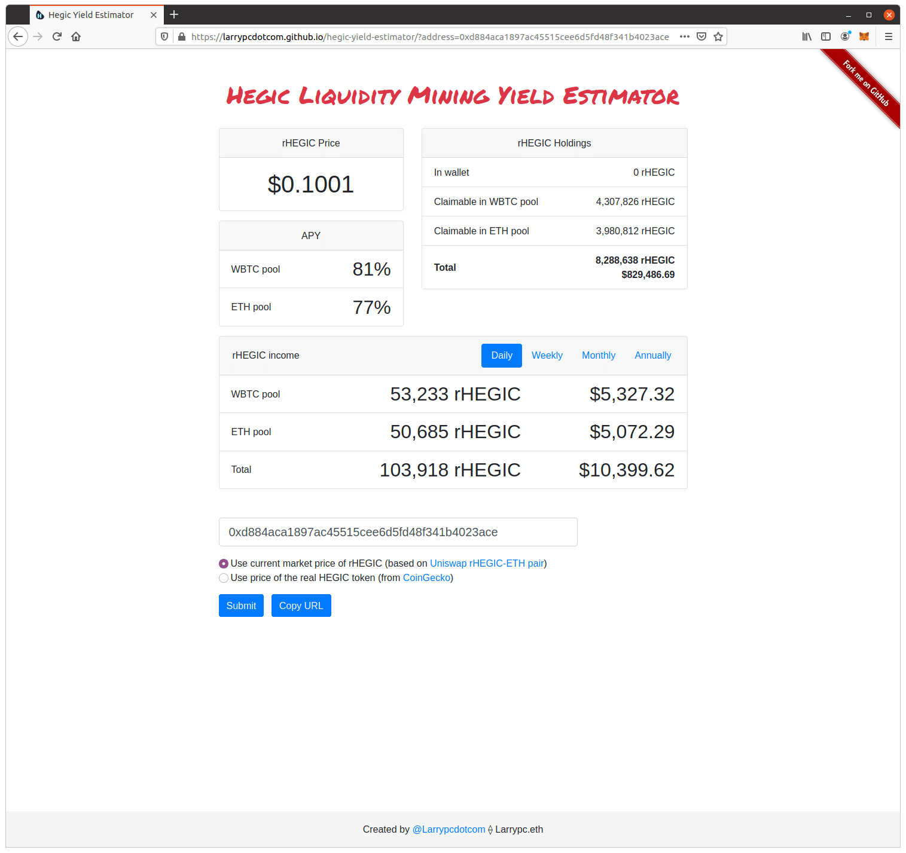
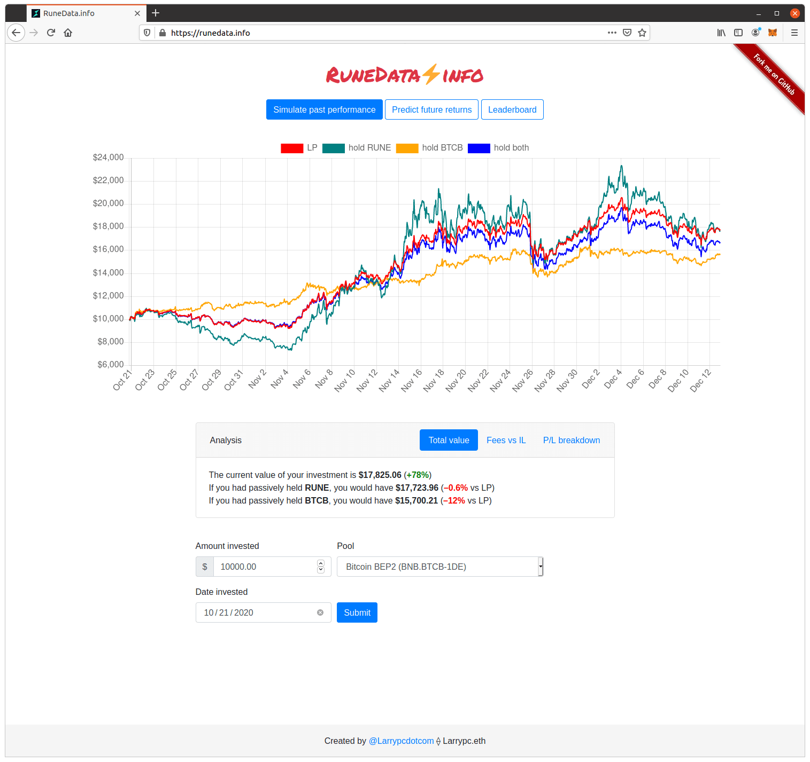

### Hi there 👋

<table>
  <tr>
    <td width="300">
      
    </td>
    <td width="500">
      <h1>Hegic AutoStake</h1>
      <a href="http://hegic.autostake.co/">website</a>
      ・
      <a href="https://github.com/Larrypcdotcom/hegic-autostake">contracts</a>
      ・
      <a href="https://github.com/Larrypcdotcom/hegic-autostake-frontend">frontend</a>
    </td>
  </tr>
  <tr>
    <td width="300">
      
    </td>
    <td width="500">
      <h1>Hegic Yield Estimator</h1>
      <a href="https://larrypcdotcom.github.io/hegic-yield-estimator/">website</a>
      ・
      <a href="https://github.com/Larrypcdotcom/hegic-yield-estimator">code</a>
    </td>
  </tr>
  <tr>
    <td width="300">
      
    </td>
    <td width="500">
      <h1>RuneData</h1>
      <a href="https://runedata.info/">website</a>
      ・
      <a href="https://github.com/Larrypcdotcom/runedata">code</a>
    </td>
  </tr>
</table>
